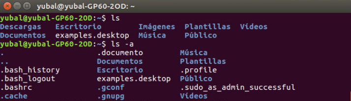

# Customizar terminal de linux

 


### ¿Te gustaría pasar de esto



### A esto?


<br>

## Instalación en BASH

Esta guía te ayudará a customizar tu terminal de linux con un diseño mas ameno. Empezaremos con una terminal con **bash** como _shell_ por defecto.

Para esto necesitaremos el framework **oh my bash** con el que instalaremos los plugins, no olvides visitar su [repositorio oficial](https://github.com/ohmybash/oh-my-bash) en github.

La instalación del framework es sencilla, solo debemos ejecutar uno de estos 2 comandos dependiendo del gestor de transferencia que usemos:

### Via curl

```bash
$ bash -c "$(curl -fsSL https://raw.githubusercontent.com/ohmybash/oh-my-bash/master/tools/install.sh)"
```

### Via wget

```bash
$ bash -c "$(wget https://raw.githubusercontent.com/ohmybash/oh-my-bash/master/tools/install.sh -O -)"
```

> Lo que hara este comando será descargar un bash script llamado **install.sh** el cual será a continuación ejecutado por el comando `bash`.

> Debes tener cuidado de **no** usar el comando `sudo` ya que de esta forma lo instalará solo para el usuario **root**.

### **Instalación de fonts**

Ahora procedemos a instalar la tipografía necesaria para este tema, en este caso será **power line fonts**, tampoco olvides visitar su [repositorio oficial](https://github.com/powerline/fonts). 

Para esto usaremos el gestor de paquetes **apt**.

```sh
$ sudo apt update
$ sudo apt-get install fonts-powerline 
```
Una vez completada la instalación, ya podremos configurar los temas; para ello debemos ir a la carpeta de **oh my bash** en nuestra carpeta de usuario, la dirección es `~/.oh-my-bash` (es una carpeta oculta, por lo que empieza con un punto). Dentro de esta carpeta, buscaremos la carpeta `themes`, dentro de esta se encuentras todos los temas con los que podemos personalizar nuestro terminal, sin embargo, el que nos interesa es uno llamado **agnoster**.

Normalmente viene instalado, pero puede darse el caso de que no lo este, por lo que debemos instalarlo, no olvides visitar su [repositorio oficial](https://github.com/speedenator/agnoster-bash) para bash.

> Si tu ya tienes agnoster, es decir, si lo encontraste en la carpeta `themes`, puedes saltarte este paso.

### **Instalación de agnoster**

Para instalarlo crearemos una carpeta de nombre agnoster en la carpeta `themes` de **oh my bash**.

```bash
$ mkdir ~/.oh-my-bash/themes/agnoster
```

Dentro crearemos un archivo llamado `agnoster.theme.sh` y guardaremos el código bash que encontraremos en este [enlace](https://raw.githubusercontent.com/speedenator/agnoster-bash/master/agnoster.bash), o podemos usar este comando para automatizar el proceso.

```bash
$ curl https://raw.githubusercontent.com/speedenator/agnoster-bash/master/agnoster.bash > ~/.oh-my-bash/agnoster/agnoster.theme.sh
```
Con esto ya tendremos el thema de agnoster instalado en nuestro **oh my bash**

### **Cambiar el tema de la terminal (por fin!)**

Bien, ya tenemos todo instalado y el siguiente paso es cambiar el archivo de configuración de bash, para ello editaremos el archivo `.bashrc` dentro de nuestra carpeta de usuario.

```bash
$ nano ~/.bashrc
```
Dentro del archivo, buscaremos en las primeras lineas el parametro

```bash
OSH_THEME="font"
```
Y cambiaremos **font** por **agnoster**, deberia quedarnos asi:

```bash
OSH_THEME="agnoster"
```
Guardamos el archivo y ejecutamos el siguiente comando:

```bash
$ source ~/.bashrc
```
Y listo! ya tenemos el tema favorito de muchos programadores para la terminal.

> Puede que necesites cerrar y volver a abrir la terminal para ver los cambios.

### **Posibles conflictos con Visual Studio Code**

La mayoria de veces tendremos conflictos con el terminal integrado de VS Code ya que las tipografías no se cargan automáticamente.

Para solucionar este problema debemos descargar directamente las tipografías compatibles desde su [repositorio oficial](https://github.com/abertsch/Menlo-for-Powerline) en github.

```bash
$ git clone https://github.com/abertsch/Menlo-for-Powerline
```
A continuación debemos copiar las tipografías a su directorio correspondiente en el árbol de linux.

```bash
$ sudo mv 'Menlo Bold for Powerline.ttf' /usr/share/fonts

$ sudo mv 'Menlo Bold Italic for Powerline.ttf' /usr/share/fonts

$ sudo mv 'Menlo for Powerline.ttf' /usr/share/fonts

$ sudo mv 'Menlo Italic for Powerline.ttf' /usr/share/fonts
```

Una vez hecho esto, abriremos VS Code y nos iremos a **File -> Preferences -> Settings**, una vez dentro escribiremos en el buscador de la parte superior **terminal font** y en la opción de *font family* pondremos **Menlo for Powerline**.


Listo! ya tenemos el tema instalado en VS Code tambien.


