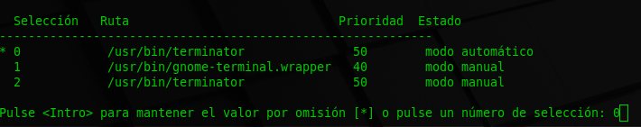

# Terminator: un emulador rápido y sencillo

 

Dentro de los emuladores de terminal que tenemos disponibles para linux, existe una gran variedad de estos; desde los que se instalan directamente, los portables y los que son aplicaciones de [electron](https://www.electronjs.org/).

En esta guía vamos a ver uno muy fácil de usar llamado **Terminator**. La instalación es muy sencilla, tan solo debemos ejecutar el siguiente comando.

```bash
$ sudo apt install terminator
```
Una vez instalado debemos cambiar el emulador de terminal por defecto con el siguiente comando.

```bash
$ sudo update-alternatives --config x-terminal-emulator
```
Nos aparecerá una lista numerada con los emuladores de terminal que tenemos instalados, tan solo debemos escribir el número correspondiente y pulsar intro.



>En este caso el número correspondiente era el 0.

Una vez realizado este paso, podremos abrir la terminal con la combinación de teclas `ctrl + alt + T`.

Sin embargo nuestro terminal tendrá la vista por defecto. A continuación daré los pasos para tener la configuración que a mi parecer es la mas minimalista y elegante posible.

Abriremos nuestra terminal y en el espacio donde escribimos texto, daremos click derecho y seleccionaremos **preferencias**. Una vez dentro tendremos distintas opciones, buscaremos en **Apariencia** y desmarcaremos la casilla de _bordes de venatana_ y marcaremos la de _No mostrar el tamaño en el titulo_.


>Tambien podemos desmarcar la casilla de _Usar fuente del sistema_ y establecer una fuente para el la barra de titulo.

Ahora iremos a la pestaña de **Perfiles**, dentro iremos a **Fondo de pantalla** y marcaremos la casilla de _Fondo transparente_, seleccionando en la barra deslizante, que tan transparente queremos la terminal.


> Con esto conseguiremos que la terminal no necesite ser minimizada en muchos casos, ya que nos permite ver a traves de ella.

Una consideración importante es la combinación de colores, ya que al ser la ventana transparente podría no hacer contraste con el color de las letras en la terminal, dificultando asi la lectura; por lo que cambiaremos de ser necesario la configuración de colores. 

Para ello iremos dentro de **Perfiles** a la pestaña **Colores** y desmarcaremos la casilla de _Usar colores del tema del sistema_ y buscaremos la combinación que mas se adecue a nuestras necesidades.


Si todo ha salido bien deberiamos obtener algo parecido a esto.


---

### **Importante**

Debido a la modificación de quitar los bordes de la ventana, ya no tendremos tan a mano las opciones de cerrar o redimencionar, por lo que debemos utilizar los atajos de teclado como `Crtl + Mayus + W` para cerrar la ventana o mantener presionada la tecla `Alt` para mover la ventana.

Con respecto al tamaño de la ventana, podemos hacer que tenga un tamaño standard cuando iniciemos la terminal, para ello debemos modificar el archivo de configuración, ejecutando el siguiente comando.

```bash
$ nano ~/.config/terminator/config
```

Dentro del archivo buscaremos las porpiedades de **Window0**.

```bash
 [[[window0]]]
  type = Window
  parent = ""
  size = 1000 , 700
  position = 100:100
```
> **Window0** es la ventana padre, debido a que terminator usa un sistema de ventanas multiples y todas heredan las caracteristicas de **Window0**.

Dentro en la propiedad **size** escribiremos el tamaño de ventana que queremos al iniciar la terminal, dicho tamaño acepta los parametros de _ancho_ y _alto_ ; en la propiedad **position** daremos la posición inicial de la ventana, dicha propiedad admite la posicion en coordenadas **X:Y**.

Y listo! ya tenemos configurado **terminator** para empezar a usarlo en nuestro día a día.

Pero terminator es una herramienta potentisima que nos permite ejecutar multiples pestañas, divirlas en grupos, etc. Te recomiento leer su [documentación](https://terminator-gtk3.readthedocs.io/en/latest/), aunque aquí te dejo 3 comandos básicos.

### **Shorcuts mas usados**

`Ctrl + Mayus + E` : Abre una nueva ventana a la derecha de la actual.

`Ctrl + Mayus + O` : Abre una nueva venatana abajo de la actual.

`Ctrl + Mayus + W` : Cierra la ventana actual.